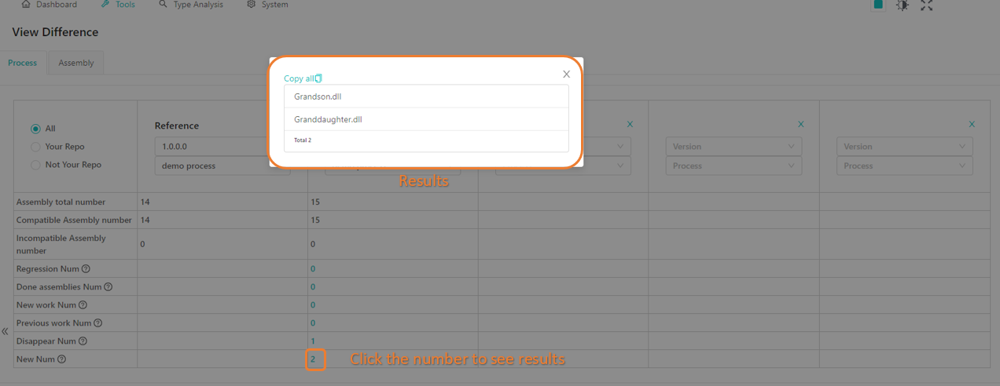

# 1. Introduction

General-purpose Dependency Graph Tool (GP-DGT) is designed to analyze and display the relationships of references among assemblies and types.

# 2. Install & Run

Run `start.ps1` or `docker-compose up` at the root path.

# 3 Assembly package demo

## Demo files

The assembly package demo consists of two folders, either folder corresponds to version 1.0.0.0 and 1.0.0.1 respectively, they are prepared for DGT to scan, analyze and generate the graph. The structures of the files in both folders are shown below.

**Folder 1.0.0.0**

Folder 1.0.0.0 consists of **Root.dll**, **Son.dll**, **Daughter.dll**, **Grandson.dll**, **Nuget.Common.dll** and **SimpleInjector.dll**. Root.dll file is the start assembly file.
## Start with a script

**Folder 1.0.0.1**

Folder 1.0.0.1 consists of **Root.dll**, **Son.dll**, **Daughter.dll**, **Grandson.dll**, **Granddaughter.dll**, **Nuget.Common.dll** and **SimpleInjector.dll**. Root.dll file is the start assembly file.

### Note 

- 1.0.0.0 and 1.0.0.1 are [assembly file versions](https://docs.microsoft.com/en-us/dotnet/standard/assembly/versioning), which means in Folder 1.0.0.0, all the assembly file versions of the repo are 1.0.0.0. The rule also adapts to Folder 1.0.0.1.
- In the figures of the files structures, system assemblies have been hidden.
- The dependency relation between every two nodes is similar to that of the ethical relation. For example, Root.dll node depends on Son.dll and Daughter.dll nodes. Son.dll node depends on Grandson.dll and Nuget.Common.dll nodes.
- In most cases, all the assembly file versions of a repo are the same, which can help to differentiate whether the current repo is NuGet or not.
- Generally, the assembly file version is the same as the [build version](https://searchsoftwarequality.techtarget.com/definition/build). Get [more information](https://docs.microsoft.com/en-us/dotnet/standard/assembly/set-attributes) here if user demands to change the assembly file version.

**The assembly file version is the same as the build version (product version).**

# 4. Operation Manual

## 4.1 Initialization

Data of analysis is required for using this tool. Users are supposed to config and scan to generate the data at the very beginning of using this tool.

### 4.1.1 Process config

#### Usage

Config the name of processes and starting assemblies before scanning.

#### Instruction

- Go to SYSTEM -> PROCESS CONFIG.

- Click ADD NEW to add a new config.

- Input process name and starting assemblies in the dialogue, click OK to submit.

- Click EDIT or DELETE to update or remove an existing config.

### 4.1.2 Scan Status

#### Usage

- Scan the targets to get data of analysis.

#### Instruction

- Go to SYSTEM -> SCAN STATUS.
- Place the file to be scanned into the workspace folder.

**Users may customise the workspace folder by changing the value of "workspace" at docker-compose.yml**

- Select the target folder and click SCAN to start the scanning. FORCE SCAN is a back up option for the case of scanning failure.

- Once the scanning is accomplished, results are displayed in the table. Results with status SUCCESS will provide data of analysis to the tools.

## 4.2 Dashboard

This page is designed to display overall information of compatible and incompatible APIs of different processes in different builds. The data of this page is from analyzing the demo we have prepared.

### Charts

The dashboard contains four charts.
- [Pie charts of version's status](#Pie-charts-of-version's-status), showing the number of compatible and incompatible APIs.
- [Trend over builds](#Trend-over-builds), showing the version status change over time.
- [Overlaps per build](#Overlaps-per-build), showing the impact on other processes.
- [All processes per build](#All-processes-per-build), showing the overall situation for all onboard processes.

**Dashboard overview**

#### Pie charts of version's status

**Proportion of compatibles and incompatibles**

- Total: Sum of the compatible and incompatible APIs from DefaultRepo and Nuget. For example, in the figure above, the number of compatible APIs in Total, 14, comes from 4 compatible APIs in DefaultRepo and 10 Compatible APIs from Nuget; and the number of Incompatible APIs in Total, 0, comes from 0 Incompatible APIs in - DefaultRepo and 0 Incompatible APIs from Nuget.
DefaultRepo: The content of the DefaultRepo pie chart comes from your repo (or your project). For example, in Demo 1.0.0.0 shown below, Root.dll, Son.dll, Daughter.dll, and GrandSon.dll are created by yourself (you define them) in your repo (or project), so the DefaultRepo pie chart is made up by these four files (nodes). Since APIs of them are all compatible, the pie chart shows that Compatible is 4 and Incompatible is 0.

**Demo 1.0.0.0**

- Nuget: NuGet is the package manager for .NET. The pie chart shows the number of compatible and incompatible APIs coming from NuGet.  For the demo case, Demo 1.0.0.0 uses 10 APIs from NuGet, so in the pie chart, the compatible is 10 and the incompatible is 0.
- Package: It shows the number of compatible and incompatible assemblies in all NuGet packages. The information in this chart is set manually. The default info shows that all the APIs are incompatible, while users can mark any NuGet assemblies compatible. The total number of APIs in the Package pie chart is the same as those in the NuGet pie chart. Visit [Assembly Detail](#5.2.5-Assembly-Details) for more information. 

#### Trend over builds

**Number of compatibles and incompatibles of each build**

#### Overlaps per build

** Overlaps and differences between current build and others**

#### All processes per build

**Number of compatibles and incompatibles of each process in the current build.**

#### Note

- The results shown on this page are from Demo 1.0.0.0.
- Make sure you match the version and process name. The version is the file version of your repo, and the process name can be found in the Process Config page.  

**Version and process**

## 4.3 Tools

### 4.3.1 Process's Root Parents

#### Usage

View the name of assemblies directly referred by a process.#### 5.2.2 Process to Assembly Path

#### Instruction

1. Select the Version and Process.
2. View results. 
3. Get Results.

**Process's Root Parent Overview**

### 4.3.2 Process to Assembly Path

#### Usage

- Find out paths from a process to an assembly.
- Estimate the quantity of work related to "De-referring".
- Check the node for work related to "Separating".

#### Instruction

1. Select Version, Process,  and Target Assembly. 
2. Select Skip Assembly. This will filter some results since the paths that contain the Skip Assembly you choose will be filtered.
4. Uncheck All paths and fill path number with a specific number to customize the number of results to display (up to 500, optional). Or check All paths to see all the results.
4. Click on the X button in the skips list to remove the assembly from the list (optional). 
5. Get Results.

**Multiple paths start from process to target assembly Overview**

### 4.3.3 Assembly to Assembly Path

#### Usage

- Find out paths from one assembly to another.
- Estimate the quantity of work related to "De-referring".
- Check the node for work related to "Separating".

#### Instruction

1. Select Version, Process, and Target Assembly.
2. Select Skip Assembly. This will filter some results since the paths that contain the Skip Assembly you choose will be filtered.
3. Uncheck All paths and fill path number with s specific number to customize the number of results to display (up to 500, optional). Or check "All paths" to see all the results.
4. Click on the X button in the skips list to remove the assembly from the list (optional). 
5. Get Results.

**Assembly to assembly overview**

### 4.3.4 Process's Assemblies

#### Usage

- View data of a process in a specific build version.
- Export data of a process.
- Find out assemblies in special conditions (contains incompatible APIs or circular reference).

#### Instruction

Select the Version and Process. 
Filter data with assembly name or other conditions. 
Click on the assembly in results to view its details (optional). 
Click on Export Total to export the results as excel (optional). 
Get Results.

**Process's asssemblies overview**

### 4.3.5 Assembly Details

#### Usage

- Add APIs to the filter list for those ported by the preprocessor. 
- Find out the path of an assembly. 
- Find out the package link of a NuGet assembly. 
- Find out assemblies referring to the selected assembly in the selected process. 
- Check updates for selected assembly.
- Set the compatibility of assemblies.

#### Instruction

See details of an assembly
1. Select the Version and Assembly to get detailed information. 
2. Select the process to filter data. 
3. Get Results.

**Assembly details overview**

##### Set the compatibility of assemblies in the Package pie chart

1. Set the version and choose an assembly.
2. Click the Create button.
3. Set HasNetCoreVersion to True.
4. Click Add Package Info (only enable when HasNetCoreVersion is True).
5. Input package information.
6. Get Results.

**Set the compatibility of assemblies in Package pie chart**

If you set the compatibility successfully, the Create button will be changed to Update and you will see the figure below.

**Set compatibility successfully**

### 4.3.6 Difference

#### Usage

- Monitor the change of the number of incompatible APIs of processes/assemblies.
- Arrange and track the work related to "Porting" and "Separation".

#### Instruction

- Select the Process or Assembly tab. 
- Select source type (optional). 
- Select the version and process/assembly name of base-build and aim-build to view results. 
- Click on the number of differences to view details. 
- Get Results.

**Difference overview**

**Go into details**

### 4.3.7 New Assembly Check

#### Usage

- Check whether the new assembly is safe before adding it to the master.

#### Instruction

- Select Version and Process.
- Select files, uploading assemblies to find out whether it will affect the .NET Core process.
- Click "Analyze", and wait for a moment to see results.
- "Not safe" means the change or addition of assembly will have an impact on the original process, which needs to be analyzed.
- "Safe" means changing or adding an assembly will not affect the original process.
- Get Results.

**Operations**

**View results**

### 4.3.8 Assembly Children Paths

#### Usage

- Get all paths from the target assembly to its children assemblies, helping to work on "eliminating incompatible APIs" tasks.

#### Instruction

- Select Version and Process.
- Select a target assembly.
- Select Must Passing Assembly.
- Choose Path number or All paths checkbox, this will affect the number of results to display.
- Get Results.

**Assembly Children Paths Overview**

### 4.3.9 Assembly Splitter

#### Usage

- Suggest a possible solution for assembly splitting.

#### Instruction
- Select build version.
- Select a target assembly.
- Input name of incoming references to put types called in same assemblies, if any.
- Input types that to be put together in same assembly, if any.
- Click on "Generate Split Solution" button and get result.

**Instruction of searching**

**The result paged in 3 tabs, the first one shows the incoming and outgoing references to the target assembly before splitting**

**The second tab shows a possible solution of splitting**

**Expand one of the child assemblies to see the types included, internal and outgoing references**

**The third tab lists all the incoming references**

**Expand one of the references to see the child assemblies called and the outgoing references**

On applying Equal Inward Assemblies:

**Input format of Equal Inward Assemblies**

**The solution will try making selected incoming references share the same dependency**

On applying Type Closures:

 
**Input format of Type Closures, same with that of Equal Inward Assemblies** 

**The solution will arrange types in same brackets into same child assemblies"**

#### Machenism

This is a brief introduction of how the target assembly is splitted. Assuming we are going to split the assembly X, which is referenced by Y and Z.

**Y and Z are assemblies depending our target assembly X, a,b,c,d and e are types of X**

On splitting, types of the target assembly directly depended by parent assemblies are "colored" respectively (a and b), then the coloring spreads through the reference of each colored type. Types with multiple up-level types in different colors will be given a new color (d is given a new color).
When the coloring is done, types are separated into groups according to their colors (a and b are seprated into different assemblies, d and e in same assembly). Types that had never been colored are separated into "Untouchable part" group (c in Untouchable part).

**The splitting machenism**

In condition of "Equal inward assemblies" is applied, types called by bundled incoming references will be colored same (if Y and Z are "Equal", a and b will be colored same).
In condition of "Type Closures" is applied, bundled types will be colored same in any condition (if a and b are bundled, they always have the same color).

## 4.4 Type Analysis

### 4.4.1 Process's Types

#### Usage

- Find out if a process/assembly contains a specific type.
- Find out the distance between a process/assembly to a type.

#### Instruction

1. Select the Process or Assembly tab. 
2. Select the Version and Process name. 
3. Add filter according to a specific condition (optional). 
4. Get Results.

**Process's types overview**

### 4.4.2 One Shortest Path Process to Type

#### Usage

- Find the shortest path from a process to a type, helpful to works related to "Separation".

#### Instruction

1. Select Version, Source Process, and Target Type.
2. Get Results.

**One Shortest Path Process To Type Overview**

### 4.4.3 One Shortest Path From Assembly to

#### Usage

- Find out the shortest path from an assembly to a type, helpful to works related to "Separation".

#### Instruction

1. Select Version, Start Assembly, and Target Type.
2. Get Results.

**One Shortest Path From Assembly To Type Overview**

### 4.4.4 Multi-Path Process to Type

#### Usage

- Find out paths from a process to a type.
- Check if it is able to dereference the target type from the Source Process through the selected node.

#### Instruction

- Select Version, Source Process, and Target Type.
- Select Skip Types and Skip Assemblies.
- Uncheck "All paths" and fill "path number" with a specific number to customize the number of results to display (up to 500, optional), or check "All paths" to see all the results.
- Get Results.

**Process's Type Overview**

### 4.4.5 Multi-Path Assembly to Type

#### Usage

- Find out paths from an assembly to a type.

#### Instruction

1. Select Version, Start Assembly, and Target Type.
2. Select Skip.
3. Uncheck "All paths" and fill "path number" with a specific number to customize the number of results to display (up to 500, optional). Or check "All paths" to see all the results.
4. Get Results.

**Multi-Path Assembly To Type Overview**